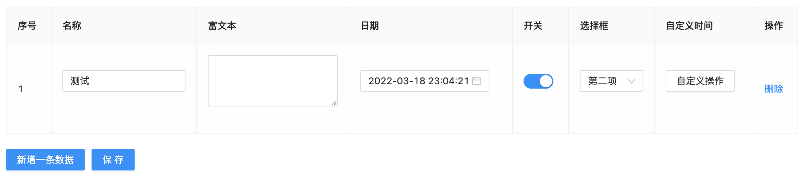

一个基于 React 的多表单输入型 Table 组件，适用于中后台多行输入型表单。简单灵活，易用上手。

## install

```
npm i react-form-input-table
```

## Development

```
npm install
npm start
```

## Usage



## Example

#### basic

```
const COLUMNS_RELATED_WORD = [{
  title: '显示搜索词',
  dataIndex: 'name',
}, {
  title: '关键词英文逗号,隔开',
  dataIndex: 'keyWords',
  rules: [],
}, {
  title: '权重',
  dataIndex: 'weight',
  inputType: 'number',
}, {
  title: '操作',
  dataIndex: 'operation',
  inputType: 'operation'
}]
const save = values => {

}
<ReactFormInputTable.d
      columns={COLUMNS_RELATED_WORD}
      dataSource={searchRelatedWordData}
      onSave={values => { save(values) }}
/>
```

## API and Usage

#### Table Properties

| Property           | Type             | Required | Explanation                                     |
| ------------------ | ---------------- | -------- | ----------------------------------------------- |
| columns            | array            | yes      | 见下面 Columns                                  |
| dataSource         | array            | yes      | 默认数据                                        |
| saveBtnText        | string           | no       | 保存按钮文案 默认 ‘保存’                        |
| addBtnText         | string           | no       | 新增按钮文案 默认添加                           |
| isSingleSave       | boolean          | no       | 是否单行保存,此模式每行数据都有保存按钮         |
| limitDataSourceLen | number           | no       | 最大的数据条数限制 超出则添加按钮 disabled 状态 |
| onSave             | (record) => void | yes      | 保存成功回调                                    |
| onDelete           | (id) => void     | no       | isSingleSave 为 true 时需要，删除一行回调       |

#### Columns

表格 title

| Property     | Type            | Required | Explanation                                                                                                                                  |
| ------------ | --------------- | -------- | -------------------------------------------------------------------------------------------------------------------------------------------- |
| title        | string          | yes      |                                                                                                                                              |
| dataIndex    | string          | yes      | 后端关联的字段名                                                                                                                             |
| inputType    | string          | no       | 'number'/'customAction'/'operation'分别表示数字类型/自定义节点类型/操作（固定类型，默认内置删除操作） <br>省略该字段默认为 string 输入框类型 |
| rules        | []              | no       | 自定义校验规则，参考 antd form,<br>默认所有项必填，传[]可表示非必填                                                                          |
| customRender | (record)=> void | no       | 自定义输出                                                                                                                                   |
| max          | number          | no       | 最大数字或最长字符串                                                                                                                         |
| min          | number          | no       | 最小数字或最短字符串                                                                                                                         |
